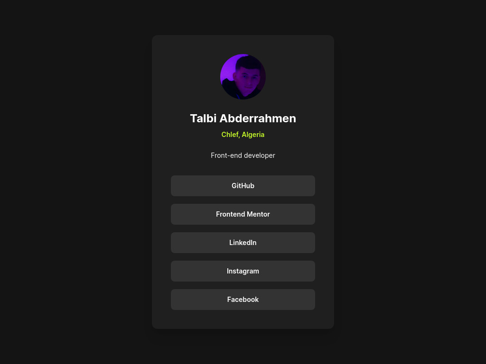

# 🌐 Profile Card

A clean and responsive **mobile profile card** built with **Next.js** and **Tailwind CSS**, inspired by a challenge from **Frontend Mentor**.

> 🚀 Live Demo: [https://profile-card-nine-chi.vercel.app](https://profile-card-nine-chi.vercel.app)

---

## 📱 Preview



---

## 🧩 Frontend Mentor Challenge

This project is a solution to the [Frontend Mentor profile card component challenge](https://www.frontendmentor.io). It focuses on building a mobile-first component with clean layout and consistent styling.

---

## 🛠️ Tech Stack

- [Next.js](https://nextjs.org/) – React framework
- [Tailwind CSS](https://tailwindcss.com/) – Utility-first CSS
- [Vercel](https://vercel.com/) – Hosting & Deployment

---

## ✨ Features

- Responsive mobile-first layout
- Tailwind-powered design
- Profile photo, name, location, and short bio
- Social media buttons (GitHub, Frontend Mentor, LinkedIn, Twitter, Instagram)
- Deployed on Vercel with continuous deployment

---

## 🚀 Getting Started

Follow these steps to run the project locally:

### 1. Clone the repository

```bash
git clone https://github.com/AbderrahmenTalbi/profile-card.git
cd profile-card
```

### 2. Install dependencies

```bash
npm install
```

### 3. Run the development server

```bash
npm run dev
```

Then open [http://localhost:3000](http://localhost:3000) in your browser.

---

## 🧪 Build for Production

```bash
npm run build
npm start
```

---

## 🎨 Customization

You can easily customize this profile card:

- **Profile Image**: Replace `public/nova.jpg` with your own photo.
- **Name, Bio, and Links**: Edit the content inside `app/page.js`  depending on your setup.
- **Colors/Fonts**: Tweak Tailwind config or use Tailwind classes directly in JSX.

---


Inspired by [Frontend Mentor](https://www.frontendmentor.io) challenges.
